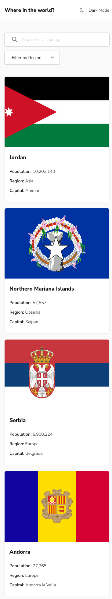
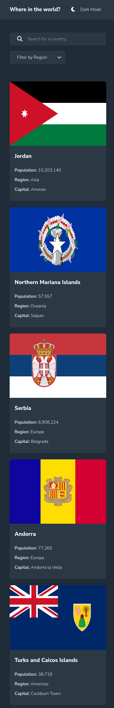
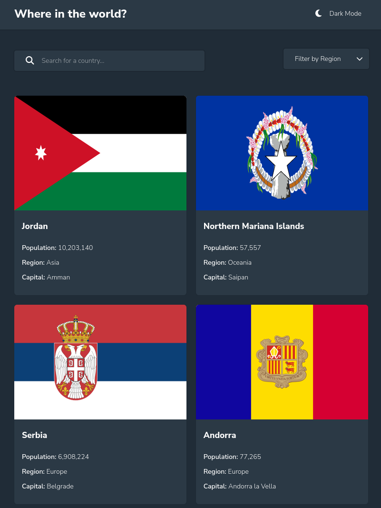
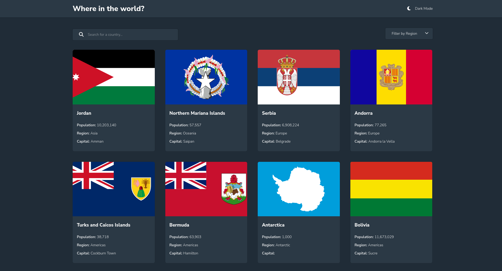
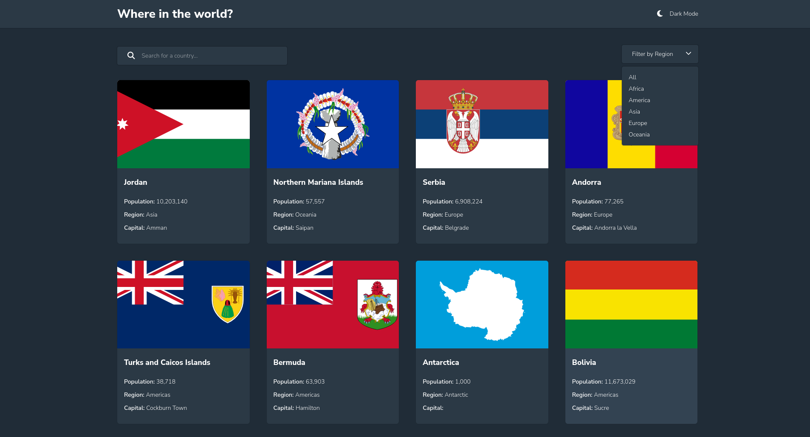

# Interactive card details form solution

This is a solution to the
[REST Countries API with color theme switcher challenge on Frontend Mentor](https://www.frontendmentor.io/challenges/rest-countries-api-with-color-theme-switcher-5cacc469fec04111f7b848ca).
Frontend Mentor challenges help you improve your coding skills by building
realistic projects.

## Table of contents

- [Overview](#overview)
- [Screenshots](#screenshots)
- [Links](#links)
- [Built with](#built-with)
- [Author](#author)

### Overview

Users should be able to:

- See all countries from the API on the homepage
- Search for a country using an `input` field
- Filter countries by region
- Click on a country to see more detailed information on a separate page
- Click through to the border countries on the detail page
- Toggle the color scheme between light and dark mode _(optional)_

### Links

- [Demo](https://where-in-the-world-ngugi.netlify.app/)

### Screenshots

#### Small Devices

#### Medium Size Devices

#### Large

### Built with

- Semantic HTML5 markup
- Sass
- React
- React Router

### Author

- [Duncan Ngugi](https://github.com/ngugimuchangi)
